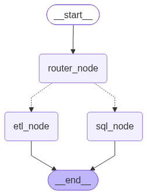
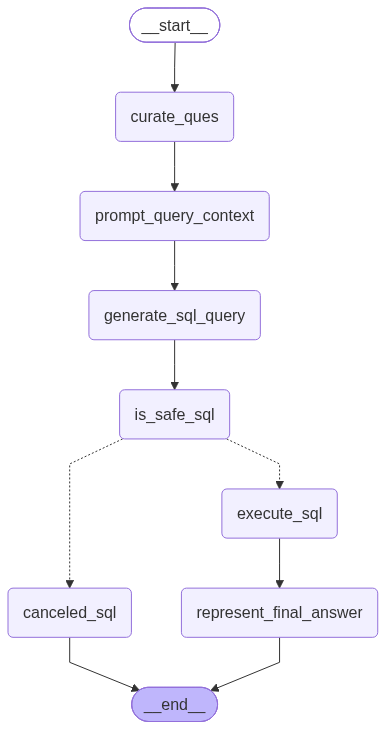
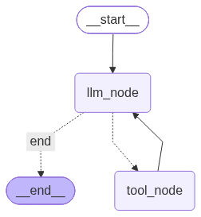

# 🤖 AI Data Agent

### An Agentic AI System for Intelligent Data Analysis, SQL Reasoning & ETL Automation

[](https://www.python.org/)
[](https://www.langchain.com/)
[](https://langchain-ai.github.io/langgraph/)
[](https://ai.google.dev/)
[](https://pandas.pydata.org/)
[](https://www.postgresql.org/)
[](https://docs.pydantic.dev/)

---

## 📌 Overview

**AI Data Agent** lets you work with data using natural language. Instead of deciding whether a request needs SQL or an ETL operation, a **LangGraph supervisor/router** classifies the request and delegates it to the right specialist agent:

- 🗄️ **SQL Analyst Agent**: turns database questions into SQL, checks the query for safety, executes approved queries, and explains the results in plain language.
- 🔄 **ETL Analyst Agent**: extracts data from APIs and transforms it with LLM-generated Pandas code, using registered tools.

**Example requests**

> "How many payments were made using credit cards after midnight?" → routed to the SQL Analyst
>
> "Fetch data from this API, transform it and save it as CSV." → routed to the ETL Analyst

---

## 🧠 Architecture

```text
                         USER (natural language)
                                  │
                                  ▼
                        ┌──────────────────┐
                        │    DATA AGENT    │
                        │ LangGraph Router │
                        └────────┬─────────┘
                                 │
                       ┌─────────┴─────────┐
                    "etl"                "sql"
                       │                   │
                       ▼                   ▼
              ┌─────────────────┐  ┌─────────────────┐
              │  ETL ANALYST    │  │  SQL ANALYST    │
              └────────┬────────┘  └────────┬────────┘
                       │                    │
                       ▼                    ▼
                  ETL Tools           Curate Question
                  • Extract                 │
                  • Transform               ▼
                  • Load             DB Context + Schema
                       │                    │
                       ▼                    ▼
                 Files / Data         Generate SQL
                                            │
                                            ▼
                                      Safety Judge
                                       ┌────┴────┐
                                     SAFE     UNSAFE
                                       │         │
                                       ▼         ▼
                                  Execute SQL  Cancel
                                       │
                                       ▼
                               Natural-Language Answer
```

The top-level graph is a `StateGraph` with conditional routing to `sql_node` or `etl_node`. Each specialist is its own LangGraph agent.

---

## ✨ Key Features

### 1. Intelligent Agent Routing
The `data_agent` classifies each request using structured output (`RouterSchema`) and stores the chosen route in the graph state. Responsibilities are split between specialized agents instead of one large monolithic prompt.

### 2. SQL Analyst Agent
The SQL graph has these nodes: `curate_ques` → `prompt_query_context` → `generate_sql_query` → `is_safe_sql` → (`execute_sql` → `represent_final_answer`) or `canceled_sql`.

- **Schema awareness**: `utils/database.py` reads PostgreSQL `information_schema` (tables, columns, data types) plus sample rows, so the LLM writes queries against the real structure instead of guessing.
- **SQL safety layer**: before execution, a structured LLM judge (`JudgeSchema`) answers `Yes`/`No` with comments on whether the query is read-only. Statements such as `INSERT`, `UPDATE`, `DELETE`, `DROP`, `ALTER`, `TRUNCATE` and `CREATE` are rejected and routed to `canceled_sql`.
- **Result interpretation**: the curated question and the execution result are passed to the LLM, which returns a concise answer. For example: *"Your database contains the following payment methods: Credit Card, Debit Card, Cash and UPI."*

### 3. ETL Analyst Agent
A tool-using LangGraph agent with two tools:

```python
extract_load_tool(url, output_folder, format)

trnasform_load_tool(input_file_path, output_folder, output_format, user_question)
```

- **Extraction**: `API URL → HTTP request → JSON → pandas.json_normalize() → output file`. Supported formats: CSV, JSON, and Parquet path handling.
- **Transformation**: the LLM receives the user request, input file, and sample data, generates Pandas code, and the ETL tool layer executes it. For example: *"Filter the records where payment amount is greater than 1000 and save the result as CSV."*

> **Note:** the transform tool name is spelled `trnasform_load_tool` in the code. Consider renaming it to `transform_load_tool`.

### 4. Structured Agent State
Pydantic models define the state passed between nodes. The SQL agent state includes `messages`, `user_question`, `curated_ques`, `prompt_query_context`, `generated_sql_query`, `is_safe`, `comments`, `sql_query_execution_result` and `final_answer`. Schemas also exist for the router, the SQL safety judge, and the ETL agent.

### 5. Configurable LLM Selection
`utils/llm_pick.py` exposes `pick_llm()` with `low`, `medium` and `high` levels, so you can swap the underlying Gemini model without touching the agents.

---

## 🛠️ Technology Stack

| Category | Technology |
|----------|------------|
| Language | Python 3.12+ |
| Agent Framework | LangGraph |
| LLM Framework | LangChain |
| LLM | Google Gemini |
| Structured Output | Pydantic |
| Data Processing | Pandas |
| Database | PostgreSQL (`psycopg2`) |
| HTTP/API | Requests |
| Config | python-dotenv |
| Development | IPython |
| Dependency Management | `pyproject.toml` + `uv.lock` |

---

## 📁 Project Structure

```text
AI-Data-Agent/
├── Models/
│   └── schema.py            # AgentSchema, ETLAgentSchema, RouterSchema, JudgeSchema
├── agents/
│   ├── data_agent.py        # Supervisor/router agent
│   ├── etl_analyst.py       # ETL specialist agent
│   └── sql_analyst.py       # SQL specialist agent
├── utils/
│   ├── database.py          # PostgreSQL utilities
│   ├── etl_tools.py         # Extraction/transformation helpers
│   └── llm_pick.py          # Gemini model selection
├── data/                    # Input/output datasets
├── main.py                  # Application entry point
├── feed_db.py               # Database/data loading
├── data_agent_graph.png     # Generated Data Agent graph
├── etl_analyst_graph.png    # Generated ETL agent graph
├── sql_analyst_graph.png    # Generated SQL agent graph
├── test_schema_details.txt  # Example schema inspection output
├── pyproject.toml
├── uv.lock
└── README.md
```

---

## ⚙️ Installation

### Prerequisites

- Python 3.12+
- PostgreSQL (running locally)
- Google Gemini API key
- `uv` or `pip`
- Git

### 1. Clone the repository

```bash
git clone https://github.com/DnyaneshwariP13/AI-Data-Agent.git
cd AI-Data-Agent
```

### 2. Create a virtual environment

```bash
python -m venv .venv

# Windows
.venv\Scripts\activate

# Linux/macOS
source .venv/bin/activate
```

### 3. Install dependencies

```bash
# with pip
pip install -e .

# or with uv
uv sync
```

### 4. Configure environment variables

Create a `.env` file in the project root:

```env
GOOGLE_API_KEY=your_google_gemini_api_key

host=localhost
port=5432
user=postgres
password=your_password
database=your_database
```

> ⚠️ Never commit API keys or passwords to GitHub. Make sure `.env` is in `.gitignore`.

### 5. Load data into PostgreSQL

Use `feed_db.py` (and the database utility layer) to load your dataset. Once loaded, the SQL Analyst can inspect the schema and generate queries against it.

---

## ▶️ Usage

```bash
python main.py
```

`main.py` invokes the top-level `data_agent` with a natural-language question and prints the resulting agent state and response.

### Example questions

**SQL analysis**

```text
What are the different types of payment methods?
How many payments are made using credit cards?
How many payments were made after midnight?
What is the average payment amount?
Which payment method is used most frequently?
```

**ETL requests**

```text
Extract the data from this API and save it as CSV.
Load the dataset and transform it based on the requested condition.
Filter the data and save the transformed dataset.
```

---

## 📊 Agent Graphs

The repository includes generated visualizations of each LangGraph workflow: `data_agent_graph.png`, `etl_analyst_graph.png` and `sql_analyst_graph.png`.





---

## 🧱 Design Principles

- **Specialized agents**: a supervisor delegates to ETL and SQL specialists, which makes the system easier to extend.
- **Graph-based orchestration**: LangGraph models nodes, state, edges, conditional routing and tool calls explicitly, which makes the workflow more deterministic and inspectable than a single prompt.
- **Structured state**: Pydantic models define what flows between nodes (user input, SQL context, generated query, safety decision, execution result, final answer) instead of relying on free-form text.
- **Generation separated from execution**: a safety check sits between SQL generation and execution.

---

## ⚠️ Current Limitations

This is a **learning/portfolio prototype**, not a production database automation platform.

- SQL safety relies largely on an LLM-based judge.
- Use a dedicated **read-only PostgreSQL user** for query execution.
- Generated Pandas code is executed by the ETL tools and should be **sandboxed** before production use.
- No authentication, authorization or multi-user isolation.
- No persistent conversation or agent memory.
- Error recovery, retries, observability and evaluation can be expanded.
- ETL output format handling can be hardened further.

---

## 🚀 Roadmap

- [ ] **Reliability**: AST-based SQL validation, read-only DB credentials, Pandas sandboxing, better exception handling, retries, input validation
- [ ] **Agent memory**: persistent conversation memory, query history, user preferences, ETL workflow retrieval
- [ ] **Advanced agentic AI**: multi-step planning, self-correction, query retry after execution errors, query optimization, confidence scoring
- [ ] **Data intelligence**: data profiling, data-quality and anomaly detection, schema drift detection, statistical tools, automated visualization
- [ ] **Productionization**: FastAPI service, web UI, authentication, Docker and cloud deployment, observability, automated evaluation, CI/CD
- [ ] **Longer term**: RAG over database documentation, semantic schema retrieval, data-quality and visualization agents, human approval workflows, tool-use tracing

---

## 📚 What This Project Demonstrates

| Area | Skills |
|------|--------|
| 🤖 Generative AI | LLM integration, prompt engineering, structured output, LLM-based routing, LLM-generated SQL and Pandas |
| 🧠 Agentic AI | LangGraph, StateGraph, conditional routing, tool calling, specialized agents, state management |
| 🗄️ Data Engineering | ETL, API ingestion, data transformation, Pandas, PostgreSQL, schema inspection |
| 🔐 AI Safety | SQL safety evaluation, query cancellation, structured safety decisions |
| 🐍 Python Engineering | Pydantic, modular architecture, utility layers, environment configuration |

---

